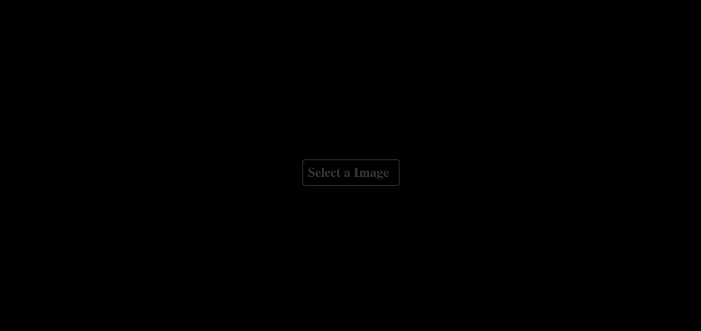

## Description:

## Starting Project:
1. Cloning the repository
-  `git clone git@github.com:Vincenzofdg/Eye_Drop.git`
2. Enter in the directory folder
- `cd Eye_Drop`
3. Iniciate `server.mjs`
- `node server.mjs`

 

